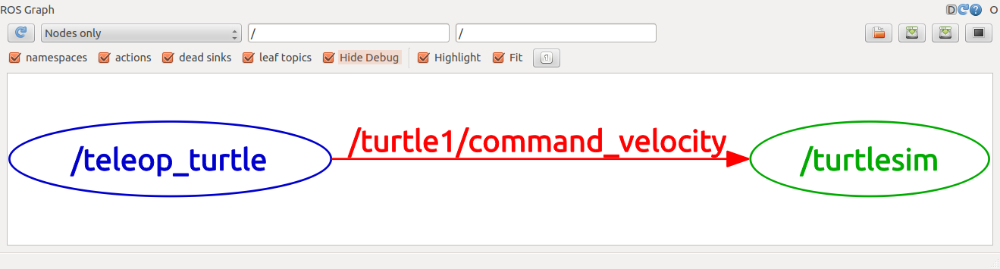

# Notes about ROS

The first thing to do is create a catkin workspace. This is a folder where all the ROS packages will be stored. To create a catkin workspace, open a terminal and type:

```bash
mkdir -p ~/catkin_ws/src
cd ~/catkin_ws/
catkin_make
```

A workspace is a folder with a particular structure. The src folder is where all the packages are stored. The catkin_make command is used to build the packages in the workspace. The catkin_make command must be run from the root of a catkin workspace. It will look for a `CMakeLists.txt` file in the src folder. This file is used to configure the build process. The CMakeLists.txt file is a standard CMake file. The catkin_make command is a wrapper around the CMake command. It will automatically invoke cmake and other necessary commands to build the packages in the workspace.

After creating the workspace, you must source the generated setup file. This will add the workspace to the `ROS_PACKAGE_PATH` environment variable. This environment variable is used by ROS to find packages. To source the generated setup file, type:

```bash
source devel/setup.bash
```

This command must be run from the root of the catkin workspace. It is recommended to add this command to the end of the `~/.bashrc` file. This will ensure that the workspace is automatically added to the `ROS_PACKAGE_PATH` environment variable whenever a new shell is launched.

To create a new package, use the catkin_create_pkg command. This command must be run from the root of the catkin workspace. The first argument is the name of the package. The `catkin_create_pkg` command will create a package folder with the same name as the package name argument. It will also create a `CMakeLists.txt` file and a package.xml file. The CMakeLists.txt file is used to configure the build process. The package.xml file is used to describe the package.

```bash
catkin_create_pkg <package_name> [depend1] [depend2] [depend3]
```

After creating a packpage you ha to use the `catkin_make` command to build the packages in the workspace. After building the workspace, you must source the generated setup file. This will add the workspace to the `ROS_PACKAGE_PATH` environment variable. This environment variable is used by ROS to find packages. To source the generated setup file, type:

```bash
source devel/setup.bash
```

So a ROS workspace is the main folder of a ROS project and is made up of several packages. A package is a folder that contains ROS nodes, libraries, datasets, configuration files, etc. A package is the smallest unit of software that can be built and distributed by ROS. A package must contain a package.xml file. This file is used to describe the package. A package must also contain a `CMakeLists.txt` file. This file is used to configure the build process. A package can contain other files and folders. The structure of a package is as follows:

```bash
package_name/
    CMakeLists.txt
    package.xml
    ...
```

# ROS tutorials

## Tutorial 2: Navigating the ROS Filesystem

Packages: Packages are the software organization unit of ROS code. Each package can contain libraries, executables, scripts, or other artifacts.

Manifests (package.xml): A manifest is a description of a package. It serves to define dependencies between packages and to capture meta information about the package like version, maintainer, license, etc.

Tools:

- **rospack:** allows you to get information about packages.
- **roscd:** allows you to change directory directly to a package or a stack.
- **rosls:** allows you to list files in a package.

## Tutorial 3-4: Creating and building a ROS Package

A workspace is composed of packpages. A typical worspace has the following structure:

```
workspace_folder/        -- WORKSPACE
  src/                   -- SOURCE SPACE
    CMakeLists.txt       -- 'Toplevel' CMake file, provided by catkin
    package_1/
      CMakeLists.txt     -- CMakeLists.txt file for package_1
      package.xml        -- Package manifest for package_1
```

To create a packpage you run: `catkin_create_pkg beginner_tutorials std_msgs rospy roscpp`

To build the workspace (all the packages in the src folder) you run: `catkin_make` in the root of the workspace.

Remember to source the generated setup file: `devel/setup.bash`

Remember to customize the package.xml file to describe the package. :smile:

## Tutorial 5: Understanding ROS Nodes

To install the tutorial files, you run `sudo apt-get install ros-noetic-ros-tutorials`

## Quick Overview of Graph Concepts

- **Nodes:** A node is an executable that uses ROS to communicate with other nodes.
- **Messages:** ROS data type used when subscribing or publishing to a topic.
- **Topics:** Nodes can publish messages to a topic as well as subscribe to a topic to receive messages.
- **Master:** Name service for ROS (i.e. helps nodes find each other)
- **rosout:** ROS equivalent of stdout/stderr
- **roscore:** Master + rosout + parameter server (parameter server will be introduced later)

The first thing to do is to run the `ruscore` command.

Then we run the example using `rosrun turtlesim turtlesim_node`

# Tutorial 6: Understanding ROS Topics

Two `nodes` can communicate if they are using the same `topic`. 

A node can `publish` to a topic or `subscribe` to a topic.

To check what's going on in the system, you can use the `rqt_graph` command.



You can use the `rostopic` command to get information about topics.

- `rostopic echo` shows the messages being published to a topic.
- `rostopic list` shows the active topics.
  
Comunication on topics is done using `messages`. 

To publish a message to a topic, you can use the `rostopic pub` command.

To check the rate of messages being published to a topic, you can use the `rostopic hz` command.

To check the type of message being published to a topic, you can use the `rostopic type` command.

To display a scrolling time plot of the data published to a topic, you can use the `rosrun rqt_plot rqt_plot` command.

## Tutorial 7: Understanding ROS Services and Parameters

A `service` allows nodes to send a request and receive a response.


# Tutorial 8: Using rqt_console and roslaunch


`roslaunch` is a tool for easily launching multiple ROS nodes defined in a launch file.

## Tutorial 9: Usung rosed to edit files in ROS

## Tutorial 10: Creating a ROS msg and srv

## Tutorial 14 Writing a Simple Publisher and Subscriber (C++)

## Tutorial 19-20-21: Not required

# Notes about the project

1. Need to use the `navigation` packpage 
   -  It takes in information from odometry[^2], sensor streams, and a goal pose and outputs safe velocity commands that are sent to a mobile base[^1]
   - Neet to set a tf transform tree in place and publish sensor data using the correct ROS Message Types
2. Need to create a map of the environment
    - Use the `gmapping` package to create a map of the environment
    - A map is described using a .bag file
3. Need to describe the robot using URDF


[^1]: A mobile base is implemented as a ROS node the receives move commands and adata from sensors.

[^2]: Odometry is the use of data from motion sensors to estimate change in position over time.